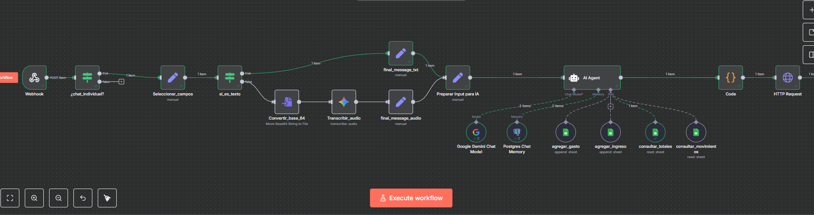

# Asistente Financiero Inteligente para WhatsApp

Este proyecto es un chatbot para WhatsApp diseñado para actuar como un asistente financiero personal. Utilizando el poder de un modelo de lenguaje de IA (Google Gemini), el bot puede entender mensajes en lenguaje natural, tanto de texto como de voz, para registrar ingresos, gastos y consultar información financiera almacenada en una hoja de cálculo de Google Sheets.

El flujo de trabajo está construido sobre una plataforma de automatización visual (como n8n) y está diseñado para funcionar exclusivamente en chats privados, ignorando cualquier mensaje proveniente de grupos de WhatsApp.

## ✨ Características Principales

- **Registro de Gastos:** Añade nuevos gastos simplemente enviando un mensaje. Ej: _"Anota un gasto de 15€ en café"_.
- **Registro de Ingresos:** Registra tus ingresos de la misma forma. Ej: _"Recibí 1500€ de mi salario"_.
- **Consulta de Saldos y Totales:** Pregunta por tus finanzas. Ej: _"¿Cuánto he gastado este mes?"_ o _"Muéstrame los totales"_.
- **Consulta de Movimientos:** Obtén un resumen de tus últimas transacciones. Ej: _"¿Cuáles son mis últimos 5 movimientos?"_.
- **Procesamiento de Mensajes de Voz:** Envía una nota de voz en lugar de escribir. El audio es transcrito y procesado por la IA.
- **Memoria Conversacional:** El bot recuerda el contexto de la conversación gracias a una base de datos PostgreSQL, permitiendo un diálogo más fluido.
- **Privacidad por Diseño:** El bot está diseñado para **ignorar automáticamente** todos los mensajes de grupos y solo responder en chats individuales.

## ⚙️ ¿Cómo Funciona? (Arquitectura del Flujo)



El flujo de trabajo sigue una secuencia lógica para procesar cada mensaje recibido:

1.  **Recepción del Mensaje (`Webhook`):** El flujo se activa cuando un nuevo mensaje de WhatsApp llega a través de un webhook.

2.  **Filtro de Chat Individual (`¿chat_individual?`):** **(Paso Clave de Privacidad)** El flujo verifica inmediatamente si el mensaje proviene de un chat individual. Si la condición no se cumple (es decir, es un chat de grupo), la automatización se detiene. Esto asegura que el bot solo opere en conversaciones privadas.

3.  **Selección y Procesamiento de Entrada (`Seleccionar_campos` y `si_es_texto`):**
    - **Si es Texto:** El mensaje de texto pasa directamente a la siguiente etapa.
    - **Si es Audio:** El mensaje de audio (recibido en formato base64) se convierte a un archivo (`Convertir_base_64`) y luego se envía a un servicio de transcripción (`Transcribir_audio`) para convertir la voz en texto.

4.  **Preparación del Input para la IA (`Preparar Input para IA`):** El texto (ya sea el original o el transcrito) se unifica y se formatea para ser procesado por el agente de IA.

5.  **Orquestación con el Agente de IA (`AI Agent`):** Este es el cerebro del bot. El `AI Agent` utiliza varios componentes para entender y actuar:
    - **Modelo:** `Google Gemini Chat Model` se encarga de entender la intención del usuario.
    - **Memoria:** `Postgres Chat Memory` le da al bot un historial de la conversación para mantener el contexto.
    - **Herramientas (Tools):** Son las acciones que la IA puede decidir ejecutar, interactuando con una hoja de Google Sheets:
        - `agregar_gasto`
        - `agregar_ingreso`
        - `consultar_totales`
        - `consultar_movimientos`

6.  **Ejecución y Respuesta (`Code` & `HTTP Request`):** Una vez que la IA ha decidido qué hacer, el resultado final se prepara y se envía de vuelta al usuario en WhatsApp a través de una solicitud HTTP a la API correspondiente.

## 🛠️ Stack Tecnológico

- **Plataforma de Automatización:** [n8n.io](https://n8n.io/) (o similar)
- **Plataforma de Mensajería:** API de WhatsApp Business (Meta Cloud)
- **Modelo de IA:** Google Gemini
- **Transcripción de Audio:** Servicio de Speech-to-Text
- **Base de Datos (Memoria):** PostgreSQL
- **Almacenamiento de Datos:** Google Sheets

## 🚀 Puesta en Marcha

Para replicar este proyecto, necesitarás:

1.  **Prerrequisitos:**
    - Una cuenta en una plataforma de automatización como n8n.
    - Acceso a las APIs de Google (Gemini, Sheets, Speech-to-Text).
    - Una cuenta de Meta for Developers con una App de WhatsApp configurada.
    - Una base de datos PostgreSQL accesible.
    - Una hoja de cálculo de Google Sheets con las columnas adecuadas.

2.  **Configuración:**
    - Importa el flujo de trabajo en tu instancia de n8n.
    - Configura las credenciales para cada servicio.
    - Copia la URL del `Webhook` y configúrala en tu App de WhatsApp en Meta.
    - Asegúrate de que las herramientas del `AI Agent` apunten a tu Google Sheet.
    - Activa el flujo de trabajo.

## 💬 Ejemplos de Uso

- **Tú:** "Agrega una compra de supermercado por 85.50"
- **Bot:** "¡Entendido! He registrado un gasto de 85.50 en 'supermercado'."

- **Tú:** (Enviando nota de voz) "Añade un ingreso de 200 por un trabajo freelance"
- **Bot:** "¡Perfecto! Ingreso de 200 por 'trabajo freelance' registrado."

- **Tú:** "¿Cuál es mi total de gastos de este mes?"
- **Bot:** "Hasta ahora, has gastado un total de 432.75 este mes."

## 🤝 Contribuciones

Las contribuciones son bienvenidas. Si tienes ideas para mejorar el bot, no dudes en abrir un *issue* o enviar un *pull request*.

## 📄 Licencia

Este proyecto se distribuye bajo la licencia MIT. Consulta el archivo `LICENSE` para más detalles.

```